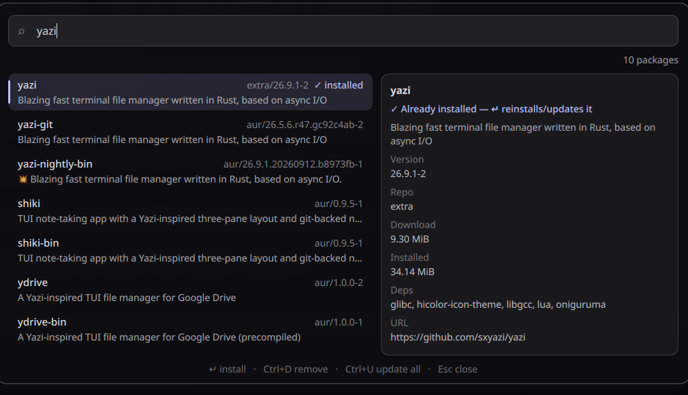
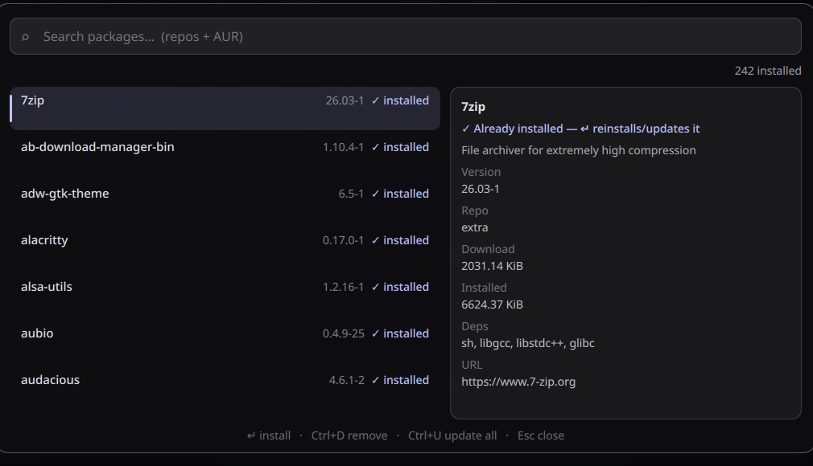
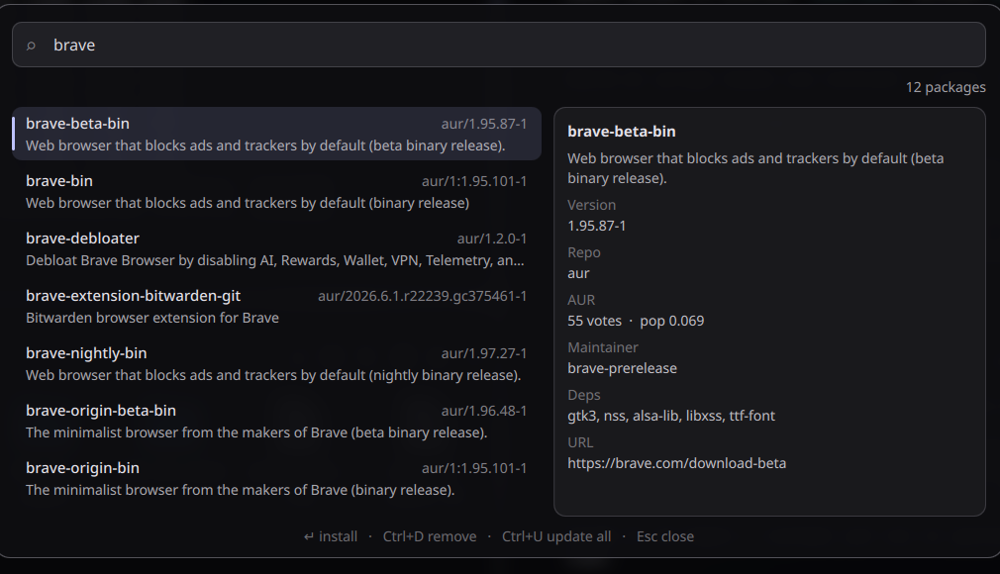

# Ambxst mods

Mods for the [Ambxst](https://github.com/Axenide/Ambxst) desktop shell (1.3+). Each
mod lives under `packages/<name>/` and installs straight from this repo — no clone
needed:

```bash
ambxst mods install https://github.com/And0Null/ambxst-mods/tree/main/packages/<name>
ambxst mods enable <mod-id>
```

The manager keeps the source URL, so `ambxst mods update <mod-id>` picks up new commits
later.

---

## pkg-launcher — `and0null.pkg-launcher` (v1.6.0)

A pacseek-style package launcher for Ambxst: type to search the sync repos (`pacman`)
and the AUR live, browse what you already have installed, and hand install/remove/update
off to an interactive terminal where your chosen AUR helper owns the sudo prompt and the
progress output.

```bash
ambxst mods install https://github.com/And0Null/ambxst-mods/tree/main/packages/pkg-launcher
ambxst mods enable and0null.pkg-launcher
```

### AUR helper: paru or yay (Settings)

The AUR side runs through whichever helper you pick — **paru** (default) or **yay**.
Pick it in **Ambxst Settings → Mods → Package launcher → AUR helper**, no config files
to edit:

1. Open Ambxst Settings, find the Package launcher mod, set **AUR helper** to `paru`
   or `yay`.
2. The setting needs a shell restart to take effect — run `ambxst reload` (Ambxst will
   also tell you a rebuild/restart is needed).
3. If the chosen binary is not installed, the launcher says so on open
   (`<helper> not found — AUR disabled`) and keeps the `pacman` repo search working;
   install/remove/update-all are blocked until you install the helper.

Requirements: `pacman`, plus the helper you select (`paru` or `yay`).

Open it with `ambxst run pkg-launcher`. There is **no default keybind** — bind it
yourself, e.g. `SUPER+SHIFT+P`:

```lua
hl.bind("SUPER + SHIFT + P", hl.dsp.exec_cmd("ambxst run pkg-launcher"))
```

Or launch it from any app launcher/menu — drop the
`extras/Package Launcher.desktop` into `~/.local/share/applications/`.

### Troubleshooting

- **Keybind does nothing / `ambxst run pkg-launcher` is not a known command** —
  the mod registers its command at shell build time. Make sure it's enabled and
  the shell was rebuilt after installing:

  ```bash
  ambxst mods enable and0null.pkg-launcher
  ambxst reload
  ```

- **You installed an old release** (published when the GitHub username was
  `AndoNull` and the mod id was `and00pium.pkg-launcher`). Both the repo URL and
  the mod id have since changed — username is now `And0Null` (zero, not "o") and
  the id is `and0null.pkg-launcher`. Ambxst treats the id as the mod's identity and
  refuses the change on update — `ambxst mods update` prints
  `Error: updated package changed its id`. Reinstall from the new URL instead:

  ```bash
  ambxst mods remove and00pium.pkg-launcher
  ambxst mods install https://github.com/And0Null/ambxst-mods/tree/main/packages/pkg-launcher
  ambxst mods enable and0null.pkg-launcher
  ambxst reload
  ```

### Screenshots

Search with the details pane (here a repo package that's already installed):



Empty query browses your installed packages:



AUR variants, with votes / popularity / maintainer / deps:



### Features

- **Live search** across repos + AUR: repo results show instantly, AUR results merge in
  when they arrive (the query is passed as an argument, never interpolated into a shell
  string).
- **Relevance ordering**: exact name → name starts with the term → name contains it →
  description-only matches. Alphabetical within each band.
- **Details pane** for the selection: download/installed size and deps for repo
  packages; votes, popularity, maintainer and out-of-date flag for AUR packages; URL.
  Fetched lazily with `<helper> -Si` (debounced).
- **Installed / update state**: `✓ instalado` badges, and `↑ <new-version>` when an
  upgrade is pending (`pacman -Qu` + `<helper> -Qua`, refreshed on every open).
- **Keyboard first**: `↵` install · `Ctrl+D` remove · `Ctrl+U` update all (`<helper> -Syu`)
  · arrows navigate · `Esc` closes. Install/remove run in your terminal; the launcher
  never touches sudo itself.
- **Empty query browses your installed packages** (explicit ones, repos + AUR).

### Requirements

`pacman`, plus the AUR helper selected in the mod's **Settings** (`paru`, the default,
or `yay`). If the selected helper is missing, the launcher disables the AUR side with a
clear message until you install it.

### Optional extras (`extras/`)

- **`Package Launcher.desktop`** — drop it in `~/.local/share/applications/` to launch
  the mod from any app launcher/menu (replace `<user>` with your username, then
  `update-desktop-database ~/.local/share/applications`).
- **`pkg-icon-sync`** — an app icon that **follows your wallpaper**: it renders the
  Phosphor "cube" glyph on a `primary` tile with the `overPrimary` glyph, straight from
  `~/.cache/ambxst/colors.json`. It writes a content-addressed icon (to defeat the icon
  caches) and repoints the `.desktop`. Point a matugen post_hook at it and the icon
  updates with every theme change:

  ```toml
  [templates.pkg-icon]
  input_path = "~/.cache/ambxst/colors.json"
  output_path = "~/.cache/narciss/pkg-icon-stamp"
  post_hook = "sleep 2; $HOME/.local/bin/pkg-icon-sync >/dev/null 2>&1"
  ```

  (needs `python3` with `Pillow` and the Phosphor font.)

---

## desktop-widgets — `and0null.desktop-widgets` (v1.11.0, staging)

> **Not published yet.** This mod is still in `staging/` (gitignored), so the install
> command below does not resolve until it moves to `packages/`.

Widgets on your desktop, not in the dashboard: a clock, a month calendar, a weather
card and a system card (CPU/temp/RAM, and GPU when detected) floating in liquid-glass
cards on an input-transparent **Bottom layer** — above the wallpaper, under every
window, like desktop icons. They step aside while a fullscreen window owns the
output, and a management menu adds/removes widgets, sets their opacity and toggles a
drag-to-move edit mode.

```bash
ambxst mods install https://github.com/And0Null/ambxst-mods/tree/main/packages/desktop-widgets
ambxst mods enable and0null.desktop-widgets
```

### Widget types

- `clock` — big time, long date, year.
- `calendar` — the dashboard's month grid, reused as-is and **sized to the card**
  instead of reimplemented, plus an **agenda** of your own calendars (any iCal/ICS feed).
  See *The calendar is the dashboard's, given a size* and *Calendar events* below.
- `weather` — current condition, temperature, wind and sunrise/sunset from
  Ambxst's WeatherService.
- `system` — CPU (with temperature), RAM and GPU usage as labelled bars.

### The calendar is the dashboard's, given a size

The `calendar` card does not draw a grid of its own: it renders
`qs.modules.widgets.dashboard.widgets.calendar` — the component the dashboard itself
uses — so the month keeps the same `StyledRect` panes, fonts and today highlight as the
rest of the shell. A second implementation of the same month would drift from that look
the first time either one changed.

What that component does not have is a size. Its metrics are fixed (32px title row, 28px
day rows, `Styling.fontSize(-2)` for the digits), so it fills whatever box it is given but
always draws the same grid: measured on a 360x360 card, the content reaches 249px and ends
81px above the card's bottom edge — glass that stays empty however tall the card gets.

`patches/calendar.patch` is the only thing this mod changes *inside* the shell, and it adds
two optional properties to that panel and to its day cell:

- **`metricScale`**, defaulting to `1`, multiplies every fixed metric. The dashboard leaves
  it at 1 and renders exactly as it always has (verified by pixel-diffing its own calendar),
  while this widget sets it from the card's size through the mod's shared rule
  (`WidgetType.typeScaleFor`). The reference is the calendar's normal card, **360x360**: a
  card that already looked right keeps rendering the base sizes, and only a bigger one grows
  the grid — a 540x540 card multiplies the cells and their digits by 1.5 (28px cells become
  42px) instead of adding another band of empty glass.
- **`showEventDots`** on the panel and **`eventDots`** on the cell, off and empty by default,
  so the dashboard's own calendar draws nothing new. The desktop calendar turns it on and
  hands each cell the colors of the calendars with something that day.
- **A day-number fix in `layout.js`**: `getPrevMonthDays` answered "30 days" for the month
  before August (July has 31), so **August's first row drew its July days one number early**
  (`27 28 29 30` where the days are `28 29 30 31`). It is a bug in the shell, not in this
  mod — found by the harness below, fixed here in one line (`new Date(year, month - 1, 0)
  .getDate()`, which also drops the leap-year special case), and reported upstream so the
  patch can go away when it lands there.

### Calendar events

`family` decides how much of the calendar arrives, and the card's height decides how much
of that fits:

| family | card | what it draws |
|---|---|---|
| `full` | 360x360 | the month grid, exactly as it has always rendered |
| `detailed` | 720x400 | the month grid plus the **agenda**: the next events from today, one row each, with the color of the calendar they come from |

A `detailed` card smaller than 520x300 falls back to the plain grid: the agenda needs a
square-ish grid (~220px at scale 1) plus a list column to be worth reading, and a row that
does not fit is not drawn at all.

The events come from **your own calendars, in one file**.
`~/.config/ambxst/desktop-widgets-calendars.json` (mode **600** — a feed URL is a
credential, and every other `~/.config/ambxst/*.json` is 644) holds a list of sources, each
one a feed URL or a local `.ics`:

```json
{ "sources": [
    { "name": "Personal", "color": "cyan",  "url":  "https://.../basic.ics", "enabled": true },
    { "name": "Facu",     "color": "green", "path": "~/.local/share/ambxst/calendar/facu.ics", "enabled": true }
] }
```

**Two doors, one model.** The file above is one way in; the second is the menu. Its
*Calendars* section lists every source — color, name, on/off switch, delete button — and
adds one from a `Name` / `Link or .ics path` pair: a `webcal://` link is stored as
`https://`, a duplicate is refused (paths are compared with `~` expanded), and anything
that is not `https://`, `webcal://` or an absolute/`~` path is refused **with the reason**.
Both doors edit the same file: the menu keeps no copy of anything, it writes the file and
reads it back, so the UI and a hand-edited file cannot drift apart. The link is never shown
in full either — just the host and the last characters, or the file name — because the
shell's log is plain text, and the file keeps mode **600** across writes.

**The menu never writes by itself.** Opening it, or reloading with it open, changes
nothing. Before any edit the service checks that it is holding a successful read of the
file; if the read has not finished, or the file is not the JSON it parses, the edit is
refused with a message rather than written — a half-loaded list would otherwise replace
every calendar in the file with nothing. That path has a harness of its own
(`tests/calendar-menu-writes.py`, below), because the failure mode is silent and it
destroys data.

- **Any provider works, because the format is the same for all of them.** Google Calendar
  gives a *Secret address in iCal format* per calendar; iCloud wants the calendar
  **published** (*Public Calendar* → Share Link, a `webcal://` URL, read here as
  `https://`); Outlook.com publishes an *ICS link* (a work admin can block it). Anything
  else that hands you an iCal link or an export works unchanged — there is no provider code
  in this mod.
- **`name` and `color` are yours.** The color is a NAME from the theme's palette
  (`primary`, `secondary`, `tertiary`, `cyan`, `green`, `magenta`, `yellow`, `blue`, `red`,
  `error`), never a hex, so it keeps matching the desktop after matugen regenerates the
  palette from a new wallpaper; a source with no color gets the next one in order.
- **Merged by UID**: the same event arriving from two sources is one event, which is what
  happens when a shared calendar is also subscribed.
- **The month grid carries the same information**: one dot per calendar with something that
  day, up to three, along the bottom edge of the cell, and the dashboard's own calendar keeps
  drawing none. Days of the neighbouring months shown in the grid get their dots too, and
  every dot follows the date the cell is really showing — which is why the day-number bug
  described above had to be fixed and not worked around.
- **Nothing runs at idle.** A URL is fetched with an async `XMLHttpRequest` every 30
  minutes; a local `.ics` is read through a `FileView` with `watchChanges`, so editing the
  file updates the desktop. No daemon, no syncer.
- **`TZID` is read as local wall time** — a deliberate limitation (`VTIMEZONE` is stepped
  over, so an event created in another zone can land hours off), while `Z` times are
  converted properly. Recurrences cover `DAILY`/`WEEKLY`/`MONTHLY`/`YEARLY` with
  `INTERVAL`, `COUNT`, `UNTIL`, weekly `BYDAY`, monthly `BYMONTHDAY` (negative included),
  `EXDATE` and `RDATE`, and the expansion is capped so a hostile rule cannot stall the UI
  thread.

### Layout file

The layout lives in `~/.config/ambxst/desktop-widgets.json`. A card's position is an
**anchor**: which edge it sticks to on each axis, plus its distance to that edge in
pixels. Sizes and distances are intrinsic, so the layout — the gaps between cards and
the margins to the screen edge — is the same on every resolution, on one monitor or
several, and a 4K output does not spread the widgets apart. `enabled: false` keeps a
widget (with its position) hidden instead of deleted:

```json
{
    "design": "custom",
    "opacity": 0.42,
    "widgets": [
        { "type": "clock", "ax": "left", "ox": 57, "ay": "top", "oy": 88, "w": 280, "h": 190, "enabled": true, "family": "full" },
        { "type": "calendar", "ax": "center", "ox": 0, "ay": "bottom", "oy": 100, "w": 360, "h": 360, "enabled": true },
        { "type": "group", "direction": "row", "ax": "left", "ox": 40, "ay": "top", "oy": 48, "w": 810, "h": 222,
          "children": [{ "type": "system", "family": "full" }, "weather", "clock"] }
    ]
}
```

`ax` is `left`/`right`/`center` and `ay` is `top`/`bottom`/`center`, with `ox`/`oy` as
pixels from those edges; `center` ignores the offset and pins the card to the middle of
the output, which is what keeps it centred at any resolution. A `group` entry lays its
`children` out as a `column` (default) or a `row`. `family` — per entry and per group
child — selects how much information a widget shows
(`compact`, `full`, `detailed`): the clock, the weather card and the system card have
three tiers each, while the calendar takes one and ignores it — its month grid has no
honest smaller form. Saving a layout never drops it. The top-level `design` field records which design the
layout came from, or `custom` once it has been edited by hand. A file that still stores
screen *fractions* (`x`/`y`) is converted once, using the biggest connected output as the
reference, so the placement you already had is preserved; the first change you make
rewrites the file in the new shape.

The menu and the drag flow write every change back through the service (debounced
during drags, saved on drag end). A drop stores the nearest edge on each axis, keeping
the side the card already had while it lands in the dead zone around the middle (half a
card wide), so nudging a centred card cannot flip its anchor and move it on another
output. Pixel distances mean the same thing everywhere, so dragging on one monitor can
no longer change where a card sits on the other. Opening the menu is not a write either:
the opacity slider is bound to the service and fires when the file's value arrives, so the
setter ignores a value it already has instead of saving the layout back untouched.

On a screen too small for the layout's own distances (under ~740px tall for the
calendar here) a card is clamped back on screen instead of hanging off the edge, and two
cards can then touch: the arrangement takes the room it takes, and there is no scale
that fits all of it everywhere.

### Managing widgets

Open the management menu with `ambxst run desktop-widgets` (bind it to a key, e.g.
`SUPER+ALT+W`):

```lua
hl.bind("SUPER + ALT + W", hl.dsp.exec_cmd("ambxst run desktop-widgets"))
```

From there you can toggle each widget's visibility, pick its **content family** with the
segmented switch on its row, remove it, add clock/calendar/weather/system widgets, add and
edit your calendars (see *Calendar events*), set the card opacity with a slider, reset to
the default layout or hit **Done**. `Esc` closes the menu.

The family switch offers exactly the tiers each widget draws: three for the clock, the
weather and the system cards, two for the calendar (it has no honest `compact` form), and
none of its own for a group card, which draws its children instead — a group gives each
child its own row and its own switch. A family this version does not know (a hand edit, or
a design from a newer one) keeps its row with **no switch at all**: nothing is offered for
a tier nothing draws, and the file keeps the value untouched. The switch itself is not the
shell's stock `SegmentedSwitch`: that one measures its highlight from the selected button
before the buttons exist, so it starts as a blob at the left edge and only lands right after
the first click. It follows the pattern the shell's own settings panel uses instead (each
selected label reports its own geometry), so the highlight is on the right label from the
first frame and is exactly as wide as that label. Two honest limits: a family
does **not** resize a card — the card's height still decides how much of it fits, so a
`detailed` tier on a short card falls back to the base layout — and re-applying a design
resets families, the same deal visibility already has.

The menu has **two shapes** and picks by screen: one column of 380px on a tall output, and
two columns side by side — the widgets on the left, the calendars on the right, the footer
across the bottom — when a single column would not fit the height. On this machine that is
one column at 1920x1080 (831px tall with one calendar) and 808x587 on the 1366x768 output,
where the single column would have been 59px too tall and hidden **Done**. The numbers are
measured, not guessed (`tests/desktop-widgets-menu-geometry.py` reads them back out of the
menu and checks the live panel against them), the calendar rows are capped per shape (6 in
one column, 4 in two) so neither shape grows with how many calendars are in the file, and a
height cap plus a scroll region remain as the backstop if a screen is smaller still. A third
column never happens: 1208px does not fit a 1366-wide output with its margins.

To move widgets around, flip **Edit layout** on: cards get a highlighted border and
become draggable (open-hand cursor); drag them, then click **Done** to commit.

While you drag, the card snaps to the edges and centres of the other cards (and to a
40px screen margin) once it is within 6px, and a 1px guide line shows what it lined up
with. That is the only way to get two cards exactly on the same line — hand-placed
cards look hand-placed. Because the snap is stored as an anchor, two aligned cards stay
aligned at every resolution.

### Designs

The arrangement comes from a **design**, applied in one click from the picker at the top
of the menu: `Split` (four cards in the corners — the default), `Rail` (a column plus the
calendar), `Studio` (one card holding clock, weather and system, plus the calendar),
`Row` (the same three side by side), `Cluster` (a tight 2x2 block), `Minimal` (clock and
calendar) and `Center` (a centred pair, top and bottom). Each button draws a real
miniature of its design — the entries are placed with the same anchor arithmetic the
desktop uses, on a 1920x1080 reference, then scaled down — so a preview cannot show
something applying the design would not do.

Designs are plain data (`DesktopWidgetsService.designs`), and every one of them has to
obey rules that are checked against pixels rather than eyeballed:

- **Fits the smallest desktop** (1366x768 here): a card that does not fit gets clamped and
  overlaps its neighbour, so no design may rely on the clamp.
- **Clears the bar**, which draws over the output and measured hides the first 45px: a
  card's top starts at 48 at the earliest.
- **Clears the dock**, which is not part of the widget layer: on a 768-tall output it
  covers the last 71 rows of the middle ~520 columns, so a card overlapping that band has
  to end above it.
- **No overlaps**, and a group card must leave each child at least 200x150 to render in.

**Align** lines up the layout you already have, in one click: per axis and anchor side,
cards whose offsets differ by up to 40px are treated as an accident and share the
largest offset (so nothing moves closer to the screen edge), while cards further apart
are a deliberate stack or another column and keep their own offsets.

The **Card opacity** slider is the cards' own alpha: how much of the wallpaper shows
through the glass. It fades the text along with the frame, and the glass's *color* is
not set here — that comes from the shell palette (`colors.json`).

### Verification

The calendar's events carry their own harnesses, because a parser that only agrees with
itself proves nothing:

| what | command |
|---|---|
| the parser's cases (89 checks) | `node tests/ics-cases.js` |
| the parser against a **second implementation** (python + dateutil) over a Google-shaped fixture | `TZ=America/Bogota python3 tests/ics-vs-oracle.py` |
| which local days carry events, from the independent side | `TZ=America/Bogota python3 tests/expected-days.py` |
| any card size and family, captured on a headless output | `python3 tests/calendar-scale-preview.py 720x400:detailed` |
| the cell -> date mapping behind the dots: 96 months, 3 timezones, the formula **extracted from the shipped patch**, checked against the `layout.js` of the deployed generation | `node tests/calendar-cells.js` |
| the sources file through the menu: opening the menu must write nothing, a real edit must write, a duplicate must be refused, and an **unparseable file must never be overwritten** | `python3 tests/calendar-menu-writes.py` |
| the menu's shape per screen: the columns it picks, the width that implies, the height it is allowed and the live panel Hyprland reports — with the constants **read out of the shipped QML** | `python3 tests/desktop-widgets-menu-geometry.py` |
| the content-family selector: the tiers the menu offers are the ones the widget QMLs draw, the switches sit on the file's families (group children included, unknown families offered nothing), a pick on an option writes through the control's own signal, and an out-of-range index writes nothing | `python3 tests/widget-family-menu.py` |

`calendar-menu-writes.py` runs each scenario against a throwaway `XDG_CONFIG_HOME`, so it
cannot touch the real `~/.config/ambxst`, and it starts a probe that instantiates the
management menu the way the shell does *and* performs the edit in the same process — both
halves of the write path at once. Adding `--generation <dir>` points it at an older build,
which is how the unparseable-file guard was shown to fix something real: against the build
before it, the same scenario reports `wrote=True` and the calendars are gone.

`ics-vs-oracle.py` is the one that matters: `ics-cases.js` checks hand-written
expectations, while the oracle reads the same fixture with its own reader and expands
recurrences with python-dateutil, so the two disagreeing is a finding. Sabotaging the
span-aware day bucketing in a copy of `ics.js` makes it fail (5 days instead of 7), which
is how the check itself is known to be able to fail. `calendar-scale-preview.py` stages a
throwaway layout on a headless output, waits for the screen to settle, captures, and
restores your layout byte-exact.

Measured, not eyeballed: capture the output twice — cards drawn, then every entry set
to `enabled: false` — and diff the two PNGs, because the differing pixels are exactly
the cards, so their boxes can be measured. A headless output makes a repeatable bench
(`hyprctl output create headless`, set its mode, capture its region, remove it). The
same layout on it:

| output | clock | weather | system (right margin) | calendar (right margin) |
|---|---|---|---|---|
| 1366x768 | 57,88 | 65,323 — 45px gap | 1007 (79px) | 960 (46px) |
| 1920x1080 | 57,88 | 65,323 — 45px gap | 1561 (79px) | 1514 (46px) |
| 2560x1440 | 57,88 | 65,323 — 45px gap | 2201 (79px) | 2154 (46px) |

Every box matched the predicted anchor within 1px of antialiasing and the two left cards
keep their 45px gap on all three. The same measurement taken on the previous
fraction-based layout overlapped those two cards by 22px on the 1366x768 panel and
pushed the calendar 71px off its right edge.

---

## Notes

- **Tested on base commit** `af9f8ad4` (listed in the manifest). Ambxst updates can move
  the patched lines.
- **Patches.** This mod patches `modules/services/Visibilities.qml`,
  `modules/services/GlobalShortcuts.qml` and `shell.qml`. Two mods inserting at
  *different* anchors compose; two hunks that share context lines do not, even when both
  only insert. That is why the Visibilities module name is registered at runtime by the
  service instead of being appended to `moduleNames` with a patch — pkg-launcher already
  inserts there.

## system-updates — `and0null.system-updates` (v1.1.0)

A compact bar button that shows pending system updates (pacman + AUR + flatpak), and
only appears when there is something to do. Left-click opens a management card with a
row per source (state, re-scan, on/off, update), **Scan all** / **Update all**, and a
"show when up to date" option. Right-click forces a full re-check.

```bash
ambxst mods install https://github.com/And0Null/ambxst-mods/tree/main/packages/system-updates
ambxst mods enable and0null.system-updates
```

### The card

```
pacman   12   ↻   [ On ]  [ Update ]
AUR       3   ↻   [ On ]  [ Update ]
flatpak   ✓   ↻   [ On ]  [ Off  ]
[   Scan all   ]  [   Update all   ]
Show in bar when up to date        [ On ]
```

- **Per source**: re-scan just that source, include it in the automatic scans, or update
  it alone.
- **Scan all / Update all** cover every enabled source.
- **Show in bar when up to date**: off (default) hides the button when everything is up
  to date; on keeps it with a green check.

### Behavior

- Scans shortly after the shell starts, then every `refreshMinutes` (default 30 —
  change it in **Ambxst Settings → Mods → System updates**, along with
  `externalOnly`).
- Each source reports its own state: `off` when not scanned, `!` on failure, `–` when it
  has never been scanned, the number when updates are pending, `✓` when it is up to
  date. A failed or never-scanned source is never shown as up to date.
- The updater runs in your terminal as a tracked child process, so the counts are
  re-scanned when the terminal actually closes — not after a guessed delay. While an
  update runs, further update clicks are ignored.
- A local `pacman -Qu` poll notices updates applied outside the mod and refreshes the
  counts.

### Requirements

`pacman` and `checkupdates` (pacman-contrib). The AUR row needs `paru` (preferred) or
`yay`; the flatpak row appears only when flatpak is installed. Sources you do not use can
be switched off in the card.

### Verification

`tests/run.sh` runs a behavioral test of the service against the real source under
Quickshell, covering the per-source state machine and the update guard. It is
falsifiable: breaking `sourceState()` fails the run. The mod was also loaded from a
built generation on Ambxst 1.3.3 (`af9f8ad4`) with no QML errors or warnings.

### Notes

- Patch surface: **`modules/bar/BarContent.qml` only** (two insertions, for the
  horizontal and vertical bar). The card reuses Ambxst's own `BarPopup`, so no
  `Visibilities.qml` patch is needed.
- The patch inserts at `@@ -520` / `@@ -727`; other mods that insert elsewhere in
  `BarContent.qml` (e.g. desktop-widgets at `@@ -1016`) compose cleanly. Two hunks
  sharing context lines would not.

## License

MIT — see [LICENSE](LICENSE).
